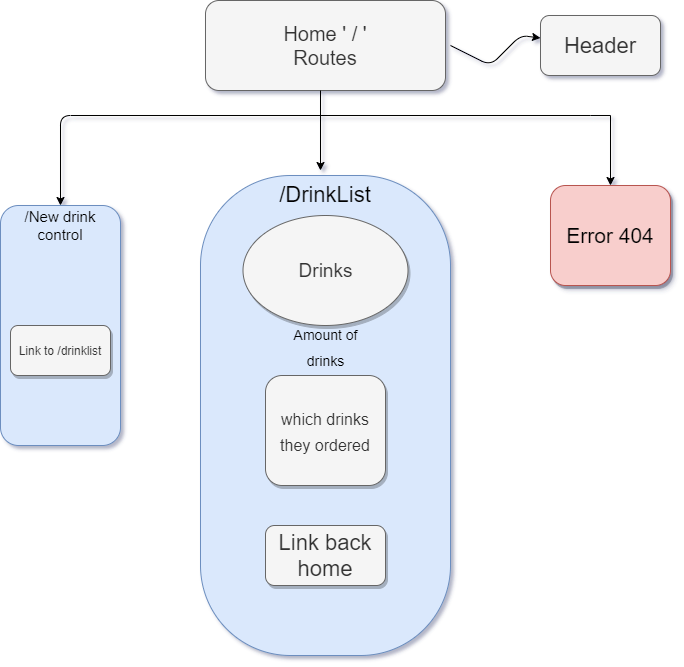

# _The Tap House_

#### _Beer menu._

#### By _**Ali Amirhamzeh**_

## Description

_A beginning website for a brewery. It will dynamically update the amount of beverages you choose and depening on the amount it will change the number from red to green.  _

## Setup/Installation Requirements

* _Clone this repository_
* _Run the command "$ npm install"_
* _Run the command "$ npm run start"_

 

_Still workingon everything. There will be more funcitonality in the future._

## Technologies Used

_JavaScript, React, HTML, CSS, Webpack_

### License

**Open-source**

Copyright (c) 2020 **_Ali Amirhamzeh_**